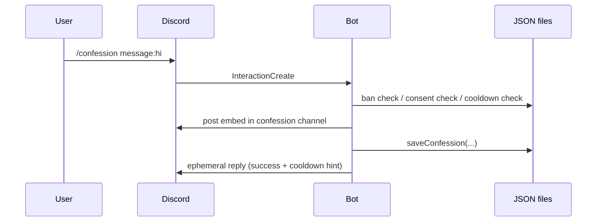

# Architecture

The bot is intentionally simple : a single Node.js process that listens to Discord events, persists state to flat JSON files, and serves global + guild slash commands.

## Module map

```
confession-bot/
├── index.js                  # Entry point — Discord client, event handlers, command routing
├── deploy-commands.js        # Slash command registration (global + guild)
├── crypto.js                 # X25519 author encryption + HMAC vote tags
├── confessions.js            # Confession data layer (split-file storage, atomic writes)
├── cooldowns.js              # Cooldown management (anonymous + public)
├── consents.js               # Opt-in consent tracking
├── bans.js                   # Ban list management
├── locales/
│   ├── en.js                 # English strings
│   ├── fr.js                 # French strings
│   ├── private.example.js    # Template for instance-specific overrides
│   └── private.js            # ⊝ Per-instance overrides (gitignored)
├── private-handlers.example.js  # Template for instance-specific Discord listeners
├── private-handlers.js       # ⊝ Per-instance event listeners (gitignored)
├── ecosystem.config.cjs      # PM2 config
├── .github/workflows/        # CI/CD auto-deploy
└── .env                      # ⊝ Secrets (gitignored)
```

`⊝` = **gitignored**, lives only on the deploy target.

## Runtime data files

These are created on first run and live alongside the code :

| File | Contents | Sensitive ? |
|---|---|---|
| `confessions-public.json` | Non-anonymous confessions, including `authorId` in clear (already public on the Discord message) and HMAC-tagged votes | Author : public anyway · Votes : tagged |
| `confessions-anon.json` | Anonymous confessions, with `authorIdEnc` encrypted at rest under `AUTHOR_PUB`, and HMAC-tagged votes | Author : encrypted · Votes : tagged |
| `cooldowns.json` | Per-user last-post timestamps + global cooldown durations | Contains userIds |
| `consents.json` | Array of user IDs who signed the contract | Contains userIds |
| `bans.json` | Array of banned user IDs | Contains userIds |

All are gitignored.

## Concurrency model

Single-process, single-threaded — no DB. All file writes go through a small wrapper :

```js
function saveFile(path, data) {
  const tmp = path + '.tmp';
  writeFileSync(tmp, JSON.stringify(data, null, 2));
  renameSync(tmp, path);  // atomic on POSIX
}
```

Each module also keeps an **in-memory cache** populated on first read (lazy load), updated synchronously on every write. This means :

- Reads are O(1) after the first hit
- Writes are O(N) (full file rewrite) but N is small (≤1000 entries by default)
- No race conditions inside the bot, since Node's event loop is single-threaded
- External processes touching the JSON files while the bot runs are dangerous — don't do it

## Slash command lifecycle



## Extension points

Two gitignored files let you customize per-instance without touching versioned code :

- **`locales/private.js`** — overrides any locale string (contract text, embed titles, etc.)
- **`private-handlers.js`** — registers extra Discord event listeners

See [Customization](../customization.md) for details.

## Where to next

- [Storage layout](storage.md) — the exact JSON shapes
- [Privacy at rest](privacy.md) — how authors and voters are protected
- [Bot lifecycle](lifecycle.md) — startup checks, hot path, shutdown
