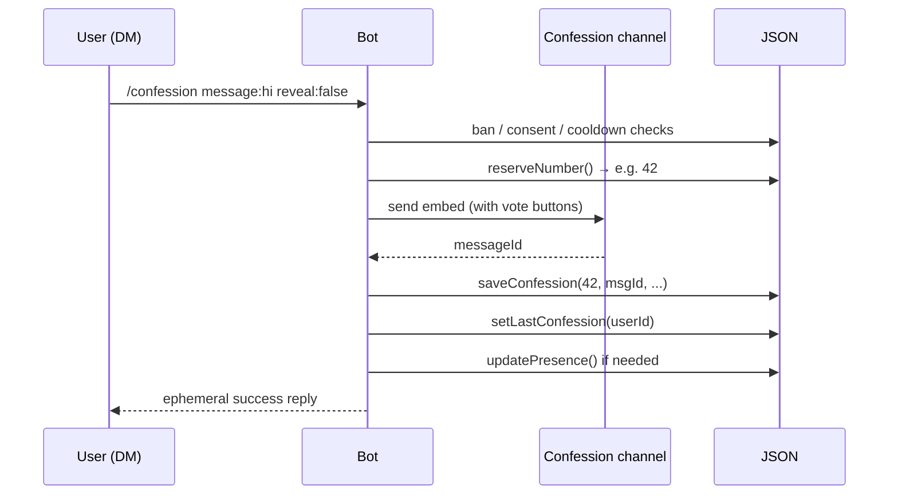

# Bot lifecycle

What happens, in order, when you `node index.js`.

## 1. Module load

Node loads `index.js`, which imports :

- `discord.js` (Client, builders, types)
- `dotenv` — and immediately calls `dotenv.config({ override: true })` so `.env` wins over shell env
- The data-layer modules (`cooldowns.js`, `confessions.js`, `consents.js`, `bans.js`)

These modules initialize empty in-memory caches and register no side effects yet (lazy load).

## 2. Environment validation

```js
const REQUIRED_ENV = ['BOT_TOKEN', 'CLIENT_ID', 'GUILD_ID', 'CONFESSION_CHANNEL_ID', 'ADMIN_ID', 'AUTHOR_PUB', 'VOTE_SECRET'];
```

Every required variable must be present. Missing → exit with a readable error.

Then the bot validates :

- All Discord IDs are 17–20 digit snowflakes
- `AUTHOR_PUB` decodes to exactly 32 bytes
- `VOTE_SECRET` decodes to at least 16 bytes

Failed validation → exit before connecting.

## 3. Locale loading

```js
let lang = (await import(`./locales/${process.env.LANG === 'fr' ? 'fr' : 'en'}.js`)).default;
try {
  const priv = (await import('./locales/private.js')).default;
  lang = { ...lang, ...priv };
} catch (e) {
  if (e.code !== 'ERR_MODULE_NOT_FOUND') process.exit(1);
}
```

The active locale is loaded, then `locales/private.js` (gitignored) is merged on top if it exists.

A **sanity check** ensures all critical keys are non-empty strings after merge — this catches typos in `private.js` early instead of at the first user interaction.

## 4. Discord client setup

```js
const client = new Client({
  intents: [GatewayIntentBits.Guilds, GatewayIntentBits.DirectMessages],
  partials: [Partials.Channel],
});
```

Only two intents — no privileged ones needed.

## 5. `ClientReady` event

The first time the bot connects to the gateway and receives `ClientReady` :

1. **Resolve `GUILD_ID`** via the API → fail-fast if invalid or bot not in server
2. **Resolve `CONFESSION_CHANNEL_ID`** → must be text-based
3. **Resolve `ADMIN_ID`** → must be a real Discord user
4. **Resolve `PARTICIPANT_ROLE_ID`** if set
5. **Check bot permissions** : `Manage Roles`, `Manage Channels`
6. **Check role hierarchy** : bot's highest role must be above the participant role
7. **Auto-fix channel permissions** :
    - `@everyone` → deny `View Channel` + `Send Messages` (unless `ALLOW_CHANNEL_MESSAGES=true`)
    - Participant role → allow `View Channel`, deny `Send Messages` (unless `ALLOW_CHANNEL_MESSAGES=true`)
    - Only writes if a fix is actually needed (idempotent)
8. **Set the live presence** : custom status `/confession en MP · N participants`

If anything fails, the bot exits with a clear message.

## 6. Optional private handlers

```js
try {
  const { default: registerPrivateHandlers } = await import('./private-handlers.js');
  await registerPrivateHandlers({ client, lang });
} catch (e) {
  if (e.code !== 'ERR_MODULE_NOT_FOUND') process.exit(1);
}
```

If `private-handlers.js` exists, its default export is called with `{ client, lang }`. Used to register per-instance event listeners that aren't versioned in the public repo (see [Customization](../customization.md)).

A missing file is silently ignored. A syntax error fails loudly.

## 7. Steady state

The bot is now reactive — it does nothing until Discord sends an event :

- **Slash command interaction** → routed by `interaction.commandName` to the right handler
- **Button interaction** → vote button (`vote_yes_N` / `vote_no_N`), playerlist pagination (`pl_*`), or contract modal opener (`open_contract_modal`)
- **Modal submit** → contract acceptance (`contract_modal`) — phrase check, consent, role assignment
- **Other events** (if any private handler registered them)

## Hot path : posting a confession



The number is **reserved before** the Discord post so the embed and the JSON entry always agree.

If the Discord post fails after reservation, the JSON entry is never created and the number is "burned" (the next confession gets `count + 2`, not `count + 1`). This is intentional — better a small numbering gap than a mismatch between what users see and what's stored.

If the JSON save fails after the Discord post, the orphan message is deleted (best-effort) and the user gets an error.

## Shutdown

The bot has no explicit graceful-shutdown handler. PM2 sends `SIGINT` / `SIGTERM` on stop / restart, Node exits, and any in-flight write was atomic, so the JSON files are always in a consistent state.

PM2 restarts the bot automatically on crash. Restart count is visible in `pm2 list`.

## Auto-migration (one-time)

The very first time the bot starts on a host that has the **legacy single-file `confessions.json`** but **not** the new split files, `confessions.js` runs the migration :

1. Read the legacy file
2. For each entry :
   - **Anonymous** → encrypt the `authorId` under `AUTHOR_PUB`, store in `confessions-anon.json`
   - **Public** → keep `authorId` in clear, store in `confessions-public.json`
   - In both cases, transform votes from plaintext userIds to HMAC tags
3. Write the two new files atomically
4. Rename the legacy file to `confessions.json.legacy-backup-<timestamp>` (kept on disk)

This runs **lazily** on first `load()` call (e.g. first interaction or first `getCount()`). On subsequent runs, the migration check sees the new files exist and skips.
