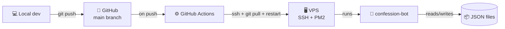

# Deployment

The recommended deployment is a small Linux VPS with **PM2** as process manager + **GitHub Actions** for auto-deploy on push to `main`. This page walks through the full setup.

## Architecture overview



## Prerequisites

- A VPS with SSH access (Debian/Ubuntu recommended)
- Node.js 18+ installed (`nvm` or apt)
- PM2 installed globally : `npm install -g pm2`
- A GitHub repo for the bot

## Initial VPS setup

```bash
ssh root@your-vps
cd /root
git clone https://github.com/your-username/confession-bot.git
cd confession-bot
npm install --omit=dev
cp .env.example .env
nano .env   # fill in real values
node deploy-commands.js
pm2 start ecosystem.config.cjs
pm2 save
pm2 startup   # follow the printed instruction to enable on-boot
```

At this point the bot should be running. Verify with :

```bash
pm2 logs confession-bot
```

You should see the green startup checklist ending with `🟢 Bot prêt.`

## GitHub Actions auto-deploy

The repo includes `.github/workflows/deploy.yml`. It runs on every push to `main` and SSHes into the VPS to update + restart the bot.

### Required GitHub secrets

In your repo settings → Secrets and variables → Actions :

| Secret | Value |
|---|---|
| `VPS_HOST` | Your VPS hostname or IP |
| `VPS_USER` | SSH user (typically `root`) |
| `VPS_PORT` | SSH port (default `22`) |
| `VPS_SSH_KEY` | A private SSH key whose public counterpart is in `~/.ssh/authorized_keys` on the VPS |

### Generating a deploy SSH key

On your local machine :

```bash
ssh-keygen -t ed25519 -f ~/.ssh/confession_deploy -C "github-actions-deploy" -N ""
ssh-copy-id -i ~/.ssh/confession_deploy.pub root@your-vps
```

Then put the contents of `~/.ssh/confession_deploy` (the private key, **not** the `.pub`) into the `VPS_SSH_KEY` GitHub secret.

### What the workflow does

```yaml
- ssh into VPS
- cd /root/confession-bot
- git pull
- npm install --omit=dev
- node deploy-commands.js     # auto-register any new slash commands
- pm2 startOrRestart ecosystem.config.cjs --update-env
- pm2 save
```

Every push to `main` triggers this. Pushes that touch only `**.md`, `.gitignore`, or `LICENSE` skip the deploy entirely (configured via `paths-ignore`).

## Updating the VPS

You don't need to SSH manually. Just :

```bash
git push
```

…and watch GitHub Actions. The deploy is typically done in 15–25 seconds.

## Manual restart

If you need to restart without pushing :

```bash
ssh root@your-vps "pm2 restart confession-bot"
```

## Logs and troubleshooting

```bash
pm2 logs confession-bot              # live logs
pm2 logs confession-bot --lines 50   # last 50 lines
pm2 flush confession-bot             # clear log buffer
pm2 list                             # status / uptime / RAM
pm2 restart confession-bot           # restart
pm2 stop confession-bot              # stop
```

## Backups

The bot's state lives in flat JSON files in the project directory :

- `confessions-public.json`
- `confessions-anon.json`
- `cooldowns.json`
- `consents.json`
- `bans.json`

Plus the `.env`. To back everything up :

```bash
ssh root@your-vps "tar czf /root/confession-bot-backup-$(date +%Y%m%d).tgz -C /root confession-bot --exclude=node_modules"
scp root@your-vps:/root/confession-bot-backup-*.tgz ./
```

Or set up a daily cron + offsite copy, depending on how much you care about the data.

## Updating Node.js or PM2

```bash
ssh root@your-vps
nvm install --lts && nvm use --lts   # if using nvm
npm install -g pm2@latest
pm2 update                            # PM2's own self-update
pm2 restart confession-bot
```

## Rollback after a bad deploy

If a push breaks the bot :

```bash
ssh root@your-vps
cd /root/confession-bot
git log --oneline -10                # find the last good commit
git reset --hard <good-sha>
npm install --omit=dev
pm2 restart confession-bot
```

Or — better — fix the issue in a new commit and push.
